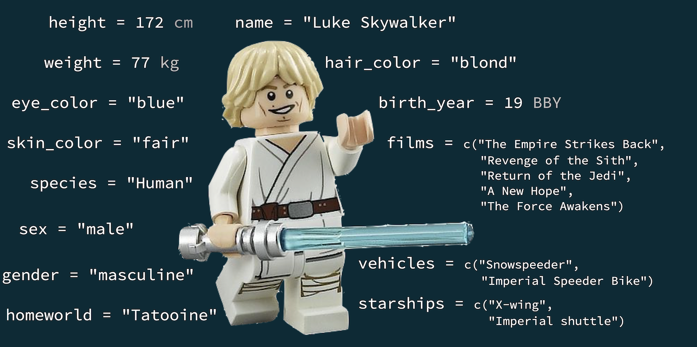

```{r setup, include = FALSE}
library(learnr)
library(tutorial.helpers)
library(tidyverse)
knitr::opts_chunk$set(echo = FALSE)
options(tutorial.exercise.timelimit = 60, 
        tutorial.storage = "local") 
```

```{r, echo = F}
bfcolor <- function(x, color) {
  if (knitr::is_latex_output()) {
    sprintf("\\textcolor{%s}{\\textbf{%s}}", color, x)
  } else if (knitr::is_html_output()) {
    sprintf("<span style='color: %s;'><b>%s</b></span>", color, x)
  } else x
}
```


```{r copy-code-chunk, child = system.file("child_documents/copy_button.Rmd", package = "tutorial.helpers")}
```

```{r info-section, child = system.file("child_documents/info_section.Rmd", package = "tutorial.helpers")}
```


##  Exploring a dataset

In this lesson, we will first explore a dataset and then learn about plotting functions in `R` to plot data. 

###


### Warming up with the `starwars` dataset

Let's look at the `starwars` data frame which is part of the  `tidyverse` library. 

{width=30%}


### Exercise 1: 

Load the `tidyverse` package.

```{r loadlib, exercise=TRUE}

```

```{r loadlib-hint-1, eval = FALSE}
library(...) # ... means you fill in the code
```

```{r loadlib-solution, eval = FALSE}
library(tidyverse) # load the tidyverse package
```

### Exercise 2: 

Use `data(...)` to load the `starwars` data frame which is part of the `tidyverse` package.

```{r loadsw, exercise=TRUE}

```

```{r loadsw-hint-1, eval = FALSE}
data(...)
```

```{r loadsw-solution, eval = FALSE}
data(starwars)
```

This makes the data stored in the `starwars` dataset available to us in the session. 

### Exercise 3: 

Take a look at the help file for the `startwars` dataset to get oriented with this dataset. 

_(The nice thing about this new lecture interface is that you should be able to run code from here directly, without having to go back into your Console or Scripts Panel!)_

```{r starwars_help, exercise=TRUE, exercise.eval=FALSE}
__replace this line with your code__
```

```{r starwars_help-hint-1, eval = FALSE}
?...
```

```{r starwars_help-solution, eval = FALSE}
?starwars
```
```{r starwars_help-test}
?starwars
```

### Exercise 4

Take a look at the data by listing the `starwars` object. 

```{r look_df,  exercise=TRUE, exercise.eval=FALSE}

```


```{r look_df-solution}
starwars
```


Get used to some **Dataframe terminology**

- Each row is an **observation**
- Each column is a **variable**


### Exercise 5 

What are some variables in this dataset? What is the name of the first observation? _(Use the arrows to scroll through all the data, including columns)_

```{r df_variable_obs-5}
question_text(NULL,
    message = "name, height, mass, hair_color, Luke Skywalker",
    answer(NULL, correct = TRUE),
    allow_retry = FALSE,
    incorrect = NULL,
    rows = 3)
```

Notice how variables have been named following the `snake_case` notation we talked about earlier? 

### 

Luke Skywalker is just one observation with many measurements made about him!


{width=70%}


The number of measurements of an observation corresponds to the number of variables(columns) in the data frame, which gives a data frame its rectangular structure!


### Let's use `R` to  get a feel for what's in the `starwars` dataset

- How many rows and columns does this dataset have?
- What does each row represent?
- What does each column represent?

### Exercise 6: Already saw `?starwars`.

From the output of `?starwars`, can you answer the questions


- How many rows and variables does this dataset have?
- What does each observation represent?
- What does each column represent?

{width=70%}


```{r ex-6}
question_text(NULL,
    message = "87 rows and 14 variables, each observation is a character in starwars and each column are different measurements about this character",
    answer(NULL, correct = TRUE),
    allow_retry = FALSE,
    incorrect = NULL,
    rows = 3)
```


but let's run a few more commands to find out how we can do this in a few ways with code.

### Using `glimpse()` to take a glimpse the data:


```{r glimpse-df,  exercise=TRUE, exercise.eval=FALSE}
glimpse(starwars) 
```

**Discuss with a peer** How is this output different from the previous one? What are the pros and cons of these various ways to look at the data? 

###  Let's try getting this information using relevant `R` commands


```{r attr-df,  exercise=TRUE, exercise.eval=FALSE}
nrow(starwars) # number of rows
ncol(starwars) # number of columns
dim(starwars)  # dimensions (row column)
names(starwars)
```


<!-- <button onclick = "transfer_code(this)">Copy previous code</button> -->

Paste the code and **the output from running the  your code** as your answer here. Use the Copy Previous code button to copy all code, use copy and paste for the output

```{r ex-7}
question_text(NULL,
    message = "87 rows and 14 variables, each observation is a character in starwars and each column are different measurements about this character",
    answer(NULL, correct = TRUE),
    allow_retry = FALSE,
    incorrect = NULL,
    rows = 3)
```

## Exploratory data analysis


### What is EDA?

- Exploratory data analysis (EDA) is an approach to analysing data sets to summarize its main characteristics
- Often, this is visual -- this is what we'll focus on first
- But we might also calculate summary statistics (we'll do next)
- and clean up data (update variables names, remove `NA`s, filter/subset data, clean up data(sub/gsub) or transform data at (or before) this stage in preparation for detailed statistical analysis/modeling (partly later but more in follow up courses :-( ) )


### Exercise 1:

How would you describe the relationship between mass and height of Starwars characters? Use a plot and describe it in the text box below

```{r plot-ht-mass,  exercise=TRUE, exercise.eval=FALSE}
plot(starwars$height, starwars$mass)
```


```{r ex-2_1}
question_text(NULL,
    message = "As ... increases ... increases (slightly) and ...",
    answer(NULL, correct = TRUE),
    allow_retry = FALSE,
    incorrect = NULL,
    rows = 3)
```


### `r bfcolor("REMEMBER:", "red")` Always add a title, and label your axes!

```{r, plot-label,  exercise=TRUE, exercise.eval=FALSE}
plot(starwars$height, starwars$mass, 
     main="Mass vs. height of Starwars characters",
     xlab="Height (cm)", ylab="Weight (kg)")


```


### Your Turn doing some EDA based on the previous plot

- What other variables would help us understand data points that don't follow the overall trend?
- Who is the not so tall but really chubby character?
    - many ways to subset `starwars` dataset to find this out!

### Exercise 2:  

Create a variable `sort_mass` that contains the masses of the individuals in the `starwars` dataset, sorted in descending order.

```{r yt1_a, exercise=TRUE, exercise.eval=FALSE}
__replace this line with your code__
```
<!-- <button onclick = "transfer_code(this)">Copy previous code</button> -->

```{r yt1_a-hint-1}
sort_mass <- sort(..., decreasing = ...)
```

```{r yt1_a-hint-2,  eval = FALSE}
sort_mass <- sort(starwars$mass, decreasing = TRUE)
```

```{r yt1_a-solution}
sort_mass <- sort(starwars$mass, decreasing = TRUE)
```

```{r yt1_a-test}
sort_mass <- sort(starwars$mass, decreasing = TRUE)
```


\

### Exercise 3:  

To work with `sort_mass` you need to know data structure that is storing `sort_mass`. How will you determine that? 


```{r yt1_b, exercise=TRUE, exercise.eval=FALSE, exercise.setup = "yt1_a-solution"}
__replace this line with your code__
```

<!-- ``{r yt1_b, exercise=TRUE, exercise.eval=FALSE} -->
<!-- __replace this line with your code__ -->
<!-- ``` -->
<!-- <button onclick = "transfer_code(this)">Copy previous code</button> -->

```{r yt1_b-hint, eval = FALSE}
class(...)
```

```{r yt1_b-solution, eval = FALSE}
class(sort_mass)
```

```{r yt1_b-test, eval = FALSE}
class(sort_mass)
```


\

### Exercise 4:   

How heavy is the heaviest individual? Use `heaviest` variable to store your result.

```{r yt1_c, exercise=TRUE, exercise.eval=FALSE, exercise.setup = "yt1_a-solution"}
__replace this line with your code__
```

```{r yt1_c-hint}
heaviest <- ...[...]
```
```{r yt1_c-solution}
heaviest <- sort_mass[1]
heaviest
# answer is 1358
```
```{r yt1_c-test, eval = FALSE}
heaviest <- sort_mass[1]
heaviest
```

\

### Exercise 5:   

What is the name of the character that is the heaviest?

```{r yt1_d, exercise=TRUE, exercise.eval=FALSE}
__replace this line with your code__
```

```{r yt1_d-hint}
which(... == 1358)
starwars[..., ]
```

```{r yt1_d-solution}
which(starwars$mass == 1358)
starwars[16, ]
starwars[which(starwars$mass == 1358), ]
```

It's Jabba

Who's Jabba?

{width=30%}


### 

Let's add Jabba to the plot

```{r plot-add-jabba, exercise=TRUE, exercise.eval=FALSE }
plot(starwars$height, starwars$mass, 
     main="Mass vs. height of Starwars characters",
     xlab="Height (cm)", ylab="Weight (kg)", 
     points(175, 1358, pch = 3, col = "red",cex = 2))


```

### Adding Jabba in another way

```{r plot-add-jabba2,exercise=TRUE, exercise.eval=FALSE }
plot(starwars$height, starwars$mass, 
     main="Mass vs. height of Starwars characters",
     xlab="Height (cm)", ylab="Weight (kg)", 
     points(starwars[16,2], 
            starwars[16,3], 
            pch = 3, col = "red",cex = 2))
    text(x= 200, y = 1350, labels = "Jabba!")

```

## Basic plotting 
### **Parameters taken by the function `plot()`**

- `type` : points, lines (`type = "l"`)
- `col` : takes values as integer from 1 to 8 (`col = 6`) or strings (`col = "violetred2")
                `colors()` gives all available color strings (about 650 of them!)
- `pch` : plotting character or symbol : values in 0:25
- `cex` : character(or symbol) expansion: size of points
- `lwd` : line width : line thickness 0.5, 1, 2 etc
- `lty` : line type (0=blank, 1=solid (default), 2=dashed, 3=dotted, 4=dotdash, 5=longdash, 6=twodash)

Play with these parameters to figure out what they do!

###  Plot parameter: `col`, `pch`

Play with these parameters to figure out what they do!

```{r plot-col-pch, exercise=TRUE, exercise.eval=FALSE}
plot(x = 1:26, y = 1:26, col = 1:8, pch = 0:25)
```

### Plot parameter: `type = "l"`, `lty`, `lwd`

Play with these parameters to figure out what they do!

```{r plot-type, exercise=TRUE, exercise.eval=FALSE}
plot(x = 1:26, y = 1:26, col = 4, type = "l", lty = 1, lwd = 2)
```

### Plot parameter: `type` can be "l"(line), "b"(both), "p"(point), "n"(none) 

```{r plot-type-b, exercise=TRUE, exercise.eval=FALSE}
plot(x = 1:8, y = 1:8, col = "red", pch = 0, type = "b")
```

###  Plot parameter: `pch`

Play with these parameters to figure out what they do! Can you add better labels for the axes? 

```{r plot-pch, exercise=TRUE, exercise.eval=FALSE}
plot(x = 1:8, y = 1:8, col = "red", pch = 0)
```

### Plot parameter: xlim, ylim 

```{r plot-withoutlim, exercise=TRUE, exercise.eval=FALSE}
plot(starwars$height, starwars$mass, 
     main = "Mass vs. height of Starwars characters",
     xlab = "Height (cm)", ylab="Weight (kg)", type = "p")
```

### **Zoom-in**

```{r plot-lim, exercise=TRUE, exercise.eval=FALSE}
plot(starwars$height, starwars$mass, 
     main = "Mass vs. height of Starwars characters",
     xlab = "Height (cm)", ylab="Weight (kg)", type = "p", 
     xlim=c(150,200),ylim=c(0,150))
```

###  Your Turn: Play Around!

Below, you will find the code used to generate the scatterplot of mass vs. height of the Starwars characters. Go ahead and play around with the various parameter values to produce a plot you think looks nice!

```{r yt2, exercise=TRUE, exercise.eval=FALSE}
plot(starwars$height, starwars$mass, 
     main = "Mass vs. height of Starwars characters",
     xlab = "Height (cm)", ylab="Weight (kg)", type = "p", 
     xlim=c(150,200),ylim=c(0,150))
```


##  Numerical data


Let's look at visual summary(plots) and also numerical summaries for data that is numerical!

###  Visualizing numerical data : Histograms

```{r hist1, exercise=TRUE, exercise.eval=FALSE}
hist(starwars$height,
     main = "Histogram of Heights of Starwars characters",
     xlab = "Height")


```

### Histograms : breaks

```{r hist2, exercise=TRUE, exercise.eval=FALSE}
hist(starwars$height,  breaks = 20,
     main = "Histogram of Heights of Starwars characters",
     xlab = "Height")
```

### Histogrmas : breaks

```{r hist3, exercise=TRUE, exercise.eval=FALSE}
hist(starwars$height,  breaks = 50,
     main = "Histogram of Heights of Starwars characters",
     xlab = "Height")
```

### Summarizing numerical data: 5 number summary

```{r echo=TRUE}
head(starwars)
```

**5 number summary**

- Min, 1st quartile (lower quarter(25\%) of data), Median, 3rd quartile (upper quarter(25\%) of data) , Max


```{r 5num, exercise=TRUE, exercise.eval=FALSE}
any(is.na(starwars$height))
x <- na.omit(starwars$height) 
c(min(x), quantile(x,0.25), median(x), quantile(x,0.75), max(x))
summary(x)


```


### Visualizing numerical data: Box plot

```{r boxplot, exercise=TRUE, exercise.eval=FALSE}
boxplot(starwars$height, 
        main ="Boxplot of Heights of Starwars characters",
     xlab = "Height", ylab = "cm")


```

 
## Categorical Data


Now, let's look at categorical data and summarizing such data both numerically and visually(plots).

###  Summarizing Categorical data : Numerically 

Use `table`

```{r table, exercise=TRUE, exercise.eval=FALSE}
gender_tbl <- table(starwars$gender )
gender_tbl


```

### Visualising categorical data : Bar-plots

```{r barplot, exercise=TRUE, exercise.eval=FALSE}
barplot(table(starwars$gender ),
        main = "Barplot of Gender of Starwars characters",
     xlab = "Gender", ylab = "Count")


```

###  Side-by-side Boxplots

Boxplots use the `y ~ x` notation. In R, this construct is called a `formula`

- Median, percentiles, quartiles, IQR, outliers

```{r sideboxplot, exercise=TRUE, exercise.eval=FALSE}
boxplot(height ~ gender, starwars, 
        xlab = "Gender", ylab = "height (cm)" )


```


###  Building Plots incrementally

It is common for complex plots to start with an *empty* plot
and layer stuff on top.

```{r plota, exercise=TRUE, exercise.eval=FALSE}
with(starwars, plot(starwars$height, starwars$mass, 
     main="Mass vs. height of Starwars characters",
     xlab="Height (cm)", ylab="Weight (kg)", type = "n"))


```

```{r plotb, exercise=TRUE, exercise.eval=FALSE}
with(starwars, plot(starwars$height, starwars$mass, 
     main="Mass vs. height of Starwars characters",
     xlab="Height (cm)", ylab="Weight (kg)", type = "n"))
with(filter(starwars, sex != "female"), points(height, mass, col="red", pch=19))


```

```{r plotc, exercise=TRUE, exercise.eval=FALSE}
with(starwars, plot(starwars$height, starwars$mass, 
     main="Mass vs. height of Starwars characters",
     xlab="Height (cm)", ylab="Weight (kg)", type = "n"))
with(filter(starwars, sex != "female"), points(height, mass, col="red", pch=19))
with(filter(starwars, sex == "female"), points(height, mass, col="blue", pch=1))


``` 

```{r plotd, exercise=TRUE, exercise.eval=FALSE}
with(starwars, plot(starwars$height, starwars$mass, 
     main="Mass vs. height of Starwars characters",
     xlab="Height (cm)", ylab="Weight (kg)", type = "n"))
with(filter(starwars, sex != "female"), points(height, mass, col="red", pch=19))
with(filter(starwars, sex == "female"), points(height, mass, col="blue", pch=1))
legend("topright", pch = c(1, 19), col = c("blue", "red"),
       legend = c("female", "Othes"))


```     

```{r download-answers, child = system.file("child_documents/download_answers.Rmd", package = "tutorial.helpers")}
```

### 

Review this tutorial and maintain a glossary of functions introduced here. You will need to submit it as part of your homework.